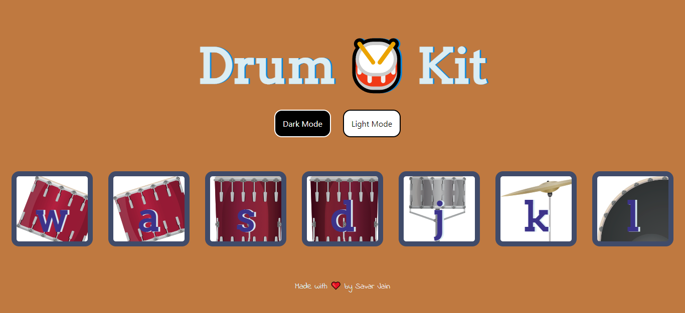
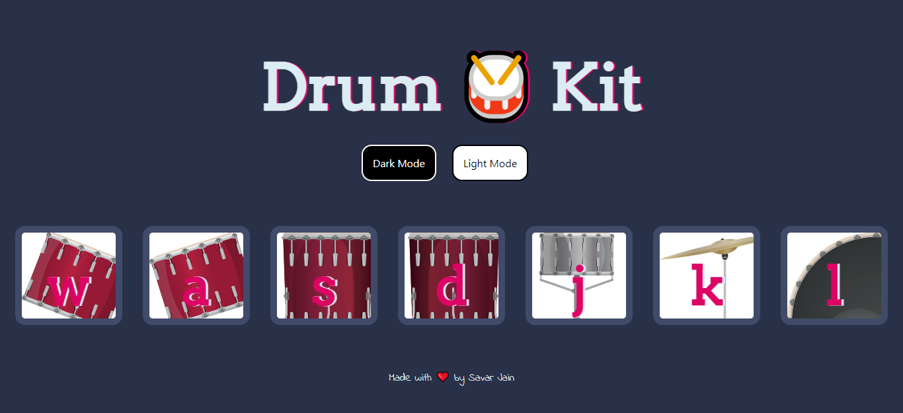

# DrumKit

A simple Drum Kit desktop web app that allows users to play the drums by clicking it or using their keyboard. Users can switch between **Light** and **Dark** Mode

 

## Table of Contents

- [Deployment](#deployment)
- [Built With](#built-with)
- [Author(s)](#authors)
- [License](#license)
- [Acknowledgement](#acknowledgement)

 

## Deployment

**[Live Demo: https://savarj.github.io/drumkit/](https://savarj.github.io/drumkit/)**

 

 

## Built With

- [HTML](https://developer.mozilla.org/en-US/docs/Web/HTML)
- [CSS](https://developer.mozilla.org/en-US/docs/Web/CSS)
- [Javascript](https://developer.mozilla.org/en-US/docs/Web/JavaScript)

## Author(s)

- **[Savar Jain](https://jainsavar.com)**

## License

Copyright (c) 2021 Savar Jain

Licensed under the [MIT License](LICENSE)

## Acknowledgement

- The Complete 2021 Web Development Bootcamp by Dr. Angela Yu
